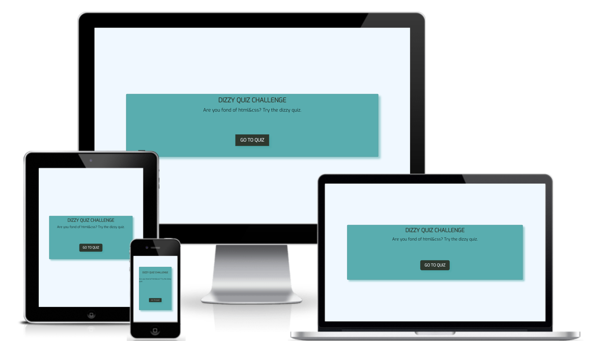
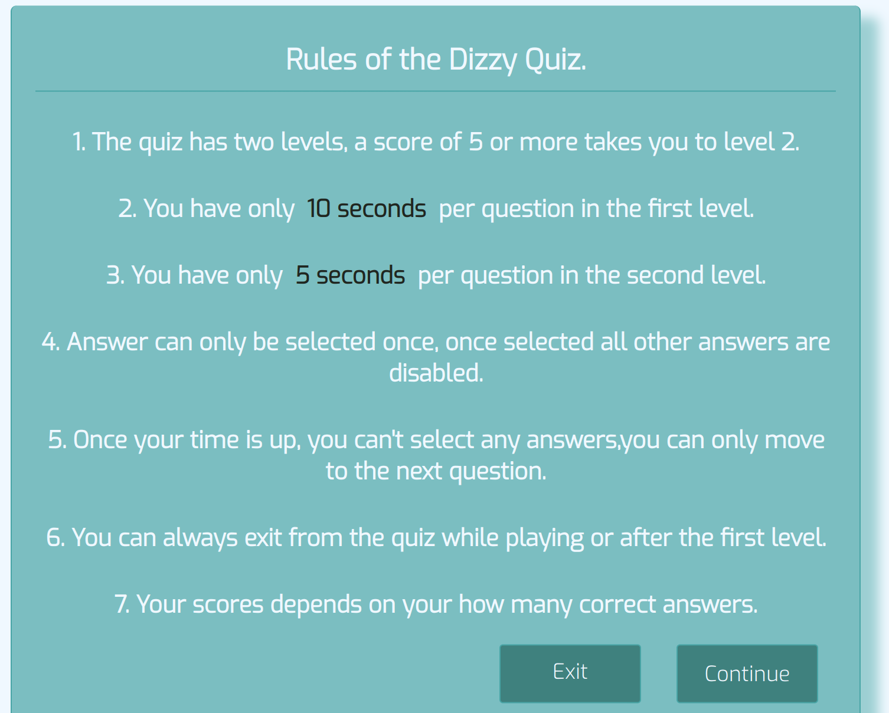
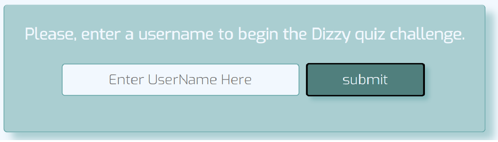
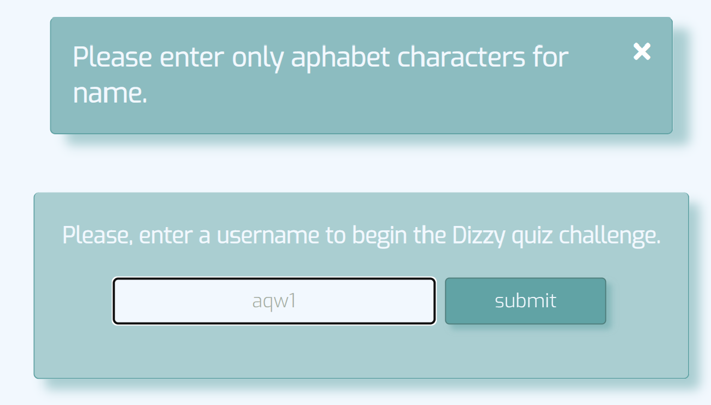
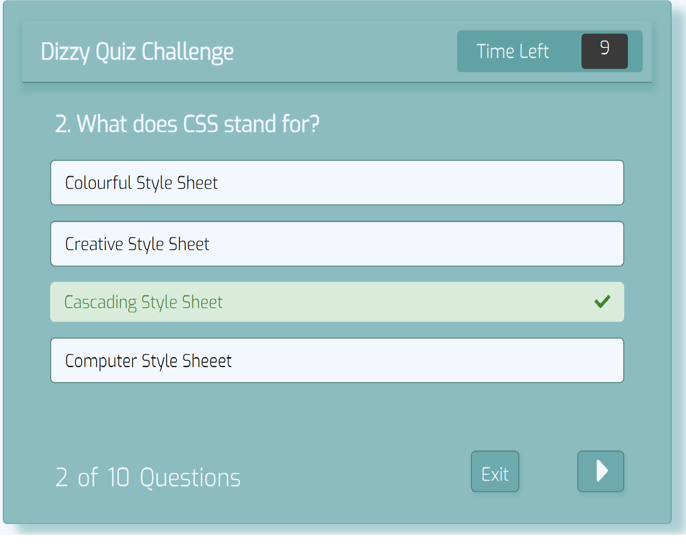
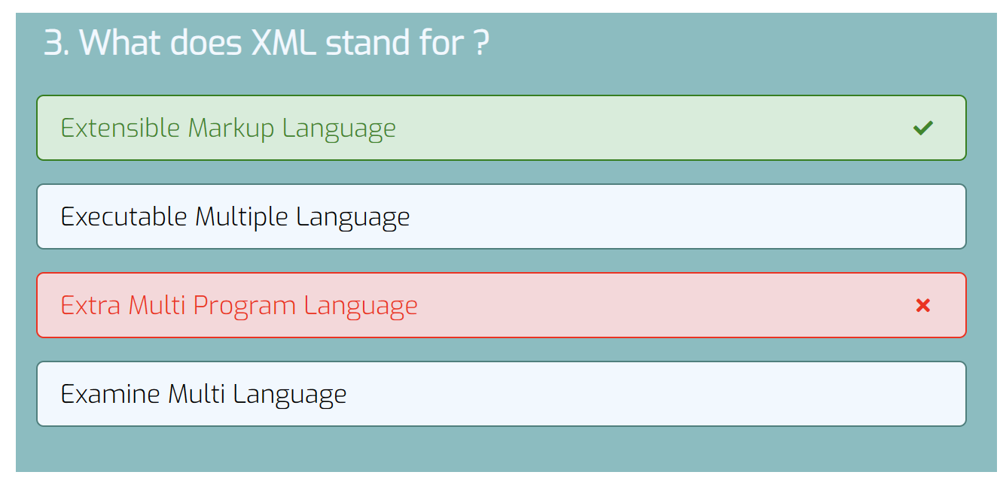
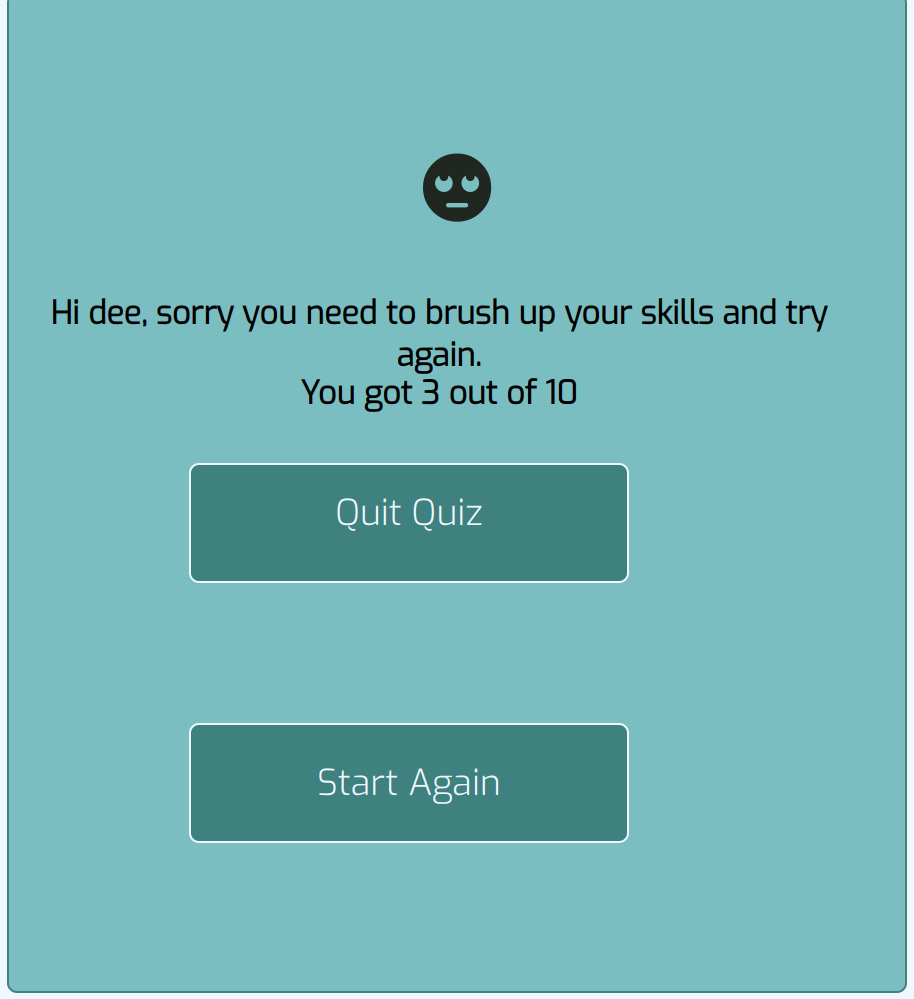
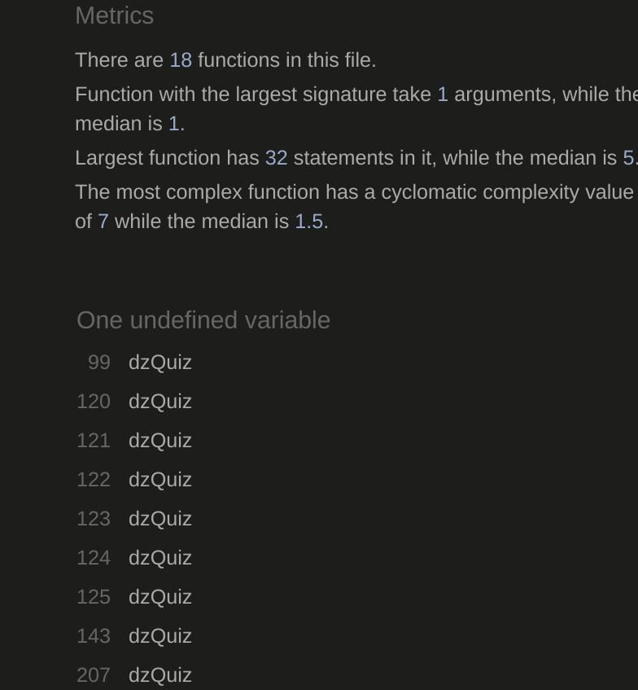
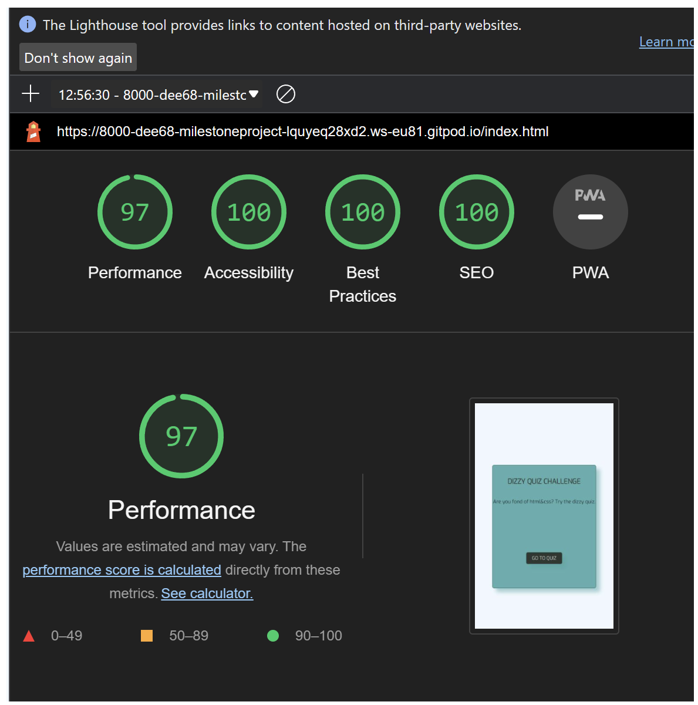

# Dizzy Quiz Challenge

- [Dizzy Quiz](#dizzy-quiz)
  * [Introduction](#introduction)
  * [User Experience (UX)](#user-experience--ux-)
    + [Target Audience](#target-audience)
    + [Strategy](#strategy)
    + [Scope](#scope)
      - [User Stories](#user-stories)
    + [Structure](#structure)
    + [Wireframes](#wireframes)
    + [Surface](#surface)
  * [Features](#features)
    + [Existing Features](#existing-features)
    + [Future Features](#future-features)
  * [Languages Used](#languages-used)
  * [Technologies Used](#technologies-used)
  * [Testing](#testing)
    + [Validator Testing](#validator-testing)
    + [Responsiveness](#responsiveness)
    + [User Stories Testing](#user-stories-testing)
    + [Manual Testing](#manual-testing)
    + [Bugs](#bugs)
    + [Unfixed Bugs](#unfixed-bugs)
  * [Deployment](#deployment)
  * [Forking and Cloning the repository]
  (#forking-and-cloning-the-repository)
    + [Forking](#forking)
    + [Making a Local Clone](#making-a-local-clone)
  * [Credits](#credits)
    + [Content](#content)
    + [Code](#code)
    + [Media](#media)
    The live website can be viewed [here](https://dee68.github.io/milestone_project2/)
## Introduction
The Dizzy quiz challenge is an educative, fun seeking interactive quiz for those who love web development. Users answer multiple choice questions with a timer and are given a feedback on their final score.

## Goal
The goal was to create an educative and entertaining web-based quiz. The html and css topics was chosen because it lay's the foundation for all web applications. Besides it will appeal to all age group that are interested in checking their theoritical knowledge of the subject domain.

## User Experience (UX)
### Target Audience
The quize targets people of all ages who enjoy quizzes and are specifically interested on web development.

### Strategy
The purpose of this online quiz is to provide an entertaining and educative quiz for people of age group who likes web development.

The quiz should be easy for the user to navigate across the different pages and return to the home page or restart the quiz. 

The application should initially be a simple design with enough interactivity to function and entertain and to which features and question content can easily be added as popularity grows.

### Scope
The project scope follows the minimal viable features approach for the initial project. However the scope is such that interactive features to enhance the user experience will be added in future.

The project is to be a simple functioning online quiz game with multiple choice questions and a timer that checks for the user's answer. The project also includes a register form to get the user's name before starting the quiz. If the time runs out, the user can not choose an answer. The quiz consists of two levels. The user can get to the second and final level only after obtaining a minimal score of 5 for the first level.

A fun feedback message will be generated with the user's score.

The purpose of the site will be clear from the landing page and will be visually attractive to the user. The site will be easy to navigate and fully responsive to all sized screens. 

### User Stories
As the site owner I want to:
* create an entertaining interactive quiz on the topic of html and css

As a general user I want to:
1. play a fun quiz
2. navigate easily around the application
3. clearly see what question number I am on
4. answer reasonably challenging questions on the topic
5. see immediately if my answer is right or wrong
6. view my final score
7. easily restart the game after I finish
8. be rated on my knowledge of the subject
9. be able to use the application on different sized screens

As a new user I want to 
* easily identify what the quiz topic is

During this phase of the project design test repositories were created to try out visuals and initial features before establishing the final respository.

### Structure

The user experience design is clear and simple with features positioned conventionally. Navigation items are clearly visible on each page signalling the pathway through the site from the home page through the quiz ending at the feedback modal. From there the user can navigate back to the home page or to the quiz start page.

[Home Page](https://dee68.github.io/milestone_project2/)
* Title: the title of the quiz appears on the home page to announce the topic of the quiz. 
* There is one clear call to action button to start the quiz.

[Quiz Page](https://dee68.github.io/milestone_project2/quiz.html)
* The rules of the quiz is clearly visible in the middle of the screen.
* The registration form is clearly visible with an input for a username and a button to validate the input.
* The welcome or thank you modal clearly visible in the middle signalling user to start the quiz.
* The question is clearly visible in the middle of the quiz play area with the four answer choices underneath.
* Above the question and answer section is the timer section showing the time required per question.
Also if user makes no choice after the time runs out, all answer choices becomes diaabled.
* When the user selects the answer the colour of the answer changes to red or green to indicate correct or incorrect before displaying the next question.

#### Wireframes
The initial wireframe designs folder for this application can be seen here:

[Wireframes](https://github.com/Dee68/milestone_project2/blob/main/readImg/)

### Surface
I’ve spoken about creating balance between an artistic and professional aesthetic throughout this site, implementing a 
minimalistic feel which I feel is suited to a website of this kind. 

Aesthetically I’ve liked the idea of a fixed side bar from the get go, so I plan on having this on every page with links 
to the other pages on here. A logo and a footer containing social media links will also feature at the top and bottom of 
this side bar, meaning you can access any page or contact details quickly and from any other page on the site. This side bar 
will collapse to a drop down menu in the header with the social links remaining at the foot of the page on smaller devices.

In keeping which my minimalistic approach I’ve chosen to use two colours that contrast one another and will use these 
throughout - #FAFAFA (white) and #366788 (blue), which I found using [ColorHunt.](https://colorhunt.co/) A lot of the images 
I plan on using are light in colour – so the white complements these whilst the blue offers a contrast where needed. I’m 
also planning on using the google font “Inter”, which is a sans-serif font similar to what she uses now. This imported 
google font along with the use of letter spacing in my CSS will help me achieve this professional and artistic look. 

The imagery used throughout this site will be a reflection on Alex herself being a photographer / artist first and foremost. 
The background of the home / landing page will be a full size image of Alex performing. A large image will also be used 
on the contact page as I feel it’s important to showcase her work where possible – I want the images to do the work really 
and add content and context where applicable.

## Features
### Existing Features

* [Home page](https://github.com/Dee68/milestone_project2/blob/index.html)

On the home page there is a 'GO TO QUIZ' button to navigate to the quiz page:

* [Quiz page](https://github.com/Dee68/milestone_project2/quiz.html)

On the quiz landing page there is the rules of the quiz,showing how the quiz will be conducted.

On navigating further after the landing page, there is the registration modal tha enables user to enter their username that will be used to give them feedback.

If the username has any non alphabet character the validation rule of the registration form throws an error and an alert message popups to inform the user what's wrong:

There is also the welcome or thank you modal that shows  up before starting the quiz:

After the thank you modal popups and user clicks the start button then popups the actual quiz challenge:

There is a timer above the question text to indicate what time is needed per question:

When the user selects an answer by clicking the answer turns either red for incorrect or green for correct and remains coloured. If the user's answer is incorrect the correct answer shows up immediately:

There is also a 'Question number' below the answers to show the user which question they are currently answering and how many questions there are in total:

Depending on the user's performance a fun feedback popups with the corresponding user's name and score:

The mouse changes to a pointer on all the clickable buttons and answer option to indicate clearly where the user can click for an action.

### Future Features

Future features to add to improve the user interface would be:

* The ability to save the user name and high scores so the user could return to the quiz to beat their own scores. 
* Currently the questions are all text-based but expanding to include visual questions with pictures would increase enjoyment for the user.
* An audio sound on completion of the game would also enhance user experience.
* Given sufficient questions, a list of questions answered correctly and incorrectly could be generated at the end of the quiz.

## Languages Used
* HTML (Hypertext Markup Language) was used to design the basic website.
* CSS (Cascading Style Sheets) to style the website and make it look more appealing to the user.
* JavaScript was used to provide interactivity to the application.

## Technologies Used

Git was used for version control. 

[Gitpod](https://www.gitpod.io/) was used for the IDE

[Balsamiq](https://balsamiq.com/) was used to create the wireframes.

[Google Fonts](https://fonts.google.com) was used for the font: Exo

[Fontawesome](https://fontawesome.com) was used for the tick and cross icons, trophy, rolling eyes and next caret.

* [HTML Validator](https://validator.w3.org/)
* [CSS Validator](https://validator.w3.org/)
* [JS Hint](https://jshint.com/)

## Testing
### Validator Testing
* [HTML Validator](https://validator.w3.org/) was run at several points during the project and small syntax errors were identified and fixed. At the final stage no errors or warnings were found.

* [CSS Validator](https://validator.w3.org/) was run several times during the project and picked up small syntax errors which were corrected. At the time of submission the css code successfully passed the validator with no errors.

* [JS Hint](https://jshint.com/) was used to check the two javascript files. No errors were found and the following metrics were returned:

* There are 18 functions in this file.

* Function with the largest signature take 1 arguments, while the median is 1.

* Largest function has 32 statements in it, while the median is 5.

* The most complex function has a cyclomatic complexity value of 7 while the median is 1.5.

The only issue is "one undefined variable" which refers to the variable `DzQuiz` which is declared in the separate quiz questions JavaScript file.

* Chrome Developer Tools was used in responsiveness design and extensively in debugging javascript functions. 
* Lighthouse in Chrome Developer Tools was used to check performance and picked up some early contrast errors in colour choice so colours were adjusted accordingly. 

### Unfixed Bugs
There are no known outstanding bugs.
## Deployment

