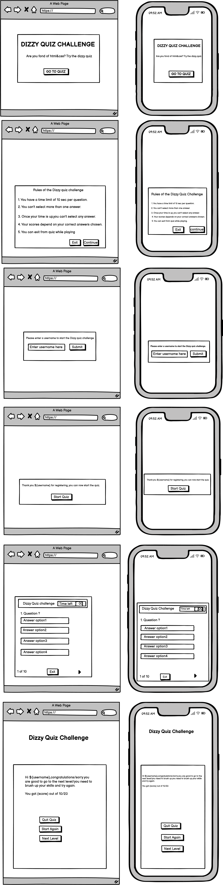
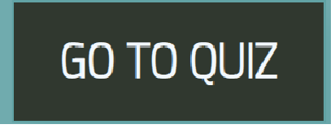
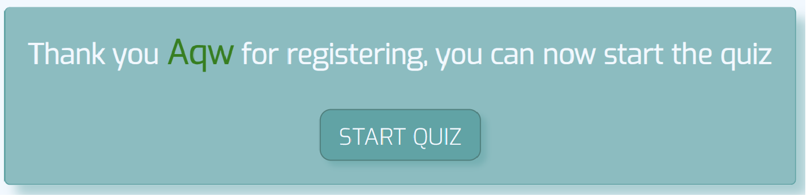
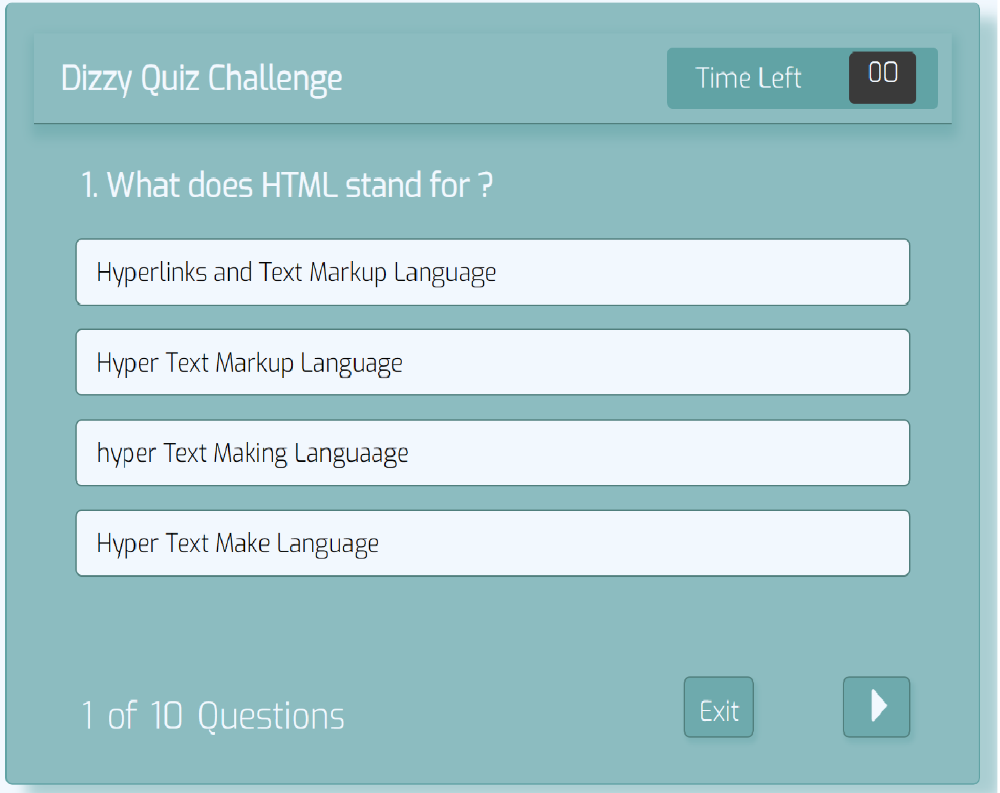
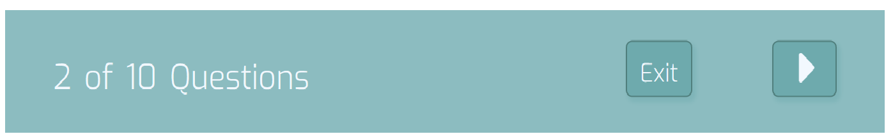
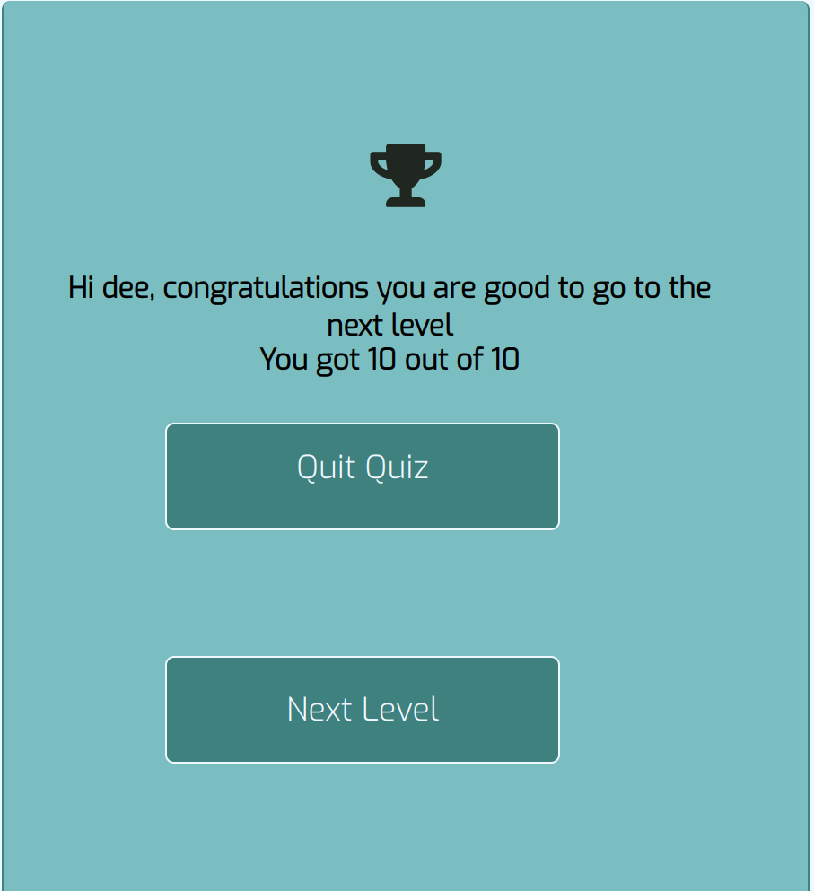

# Dizzy Quiz Challenge

- [Dizzy Quiz](#dizzy-quiz)
  * [Introduction](#introduction)
  * [User Experience (UX)](#user-experience--ux-)
    + [Target Audience](#target-audience)
    + [Strategy](#strategy)
    + [Scope](#scope)
      - [User Stories](#user-stories)
    + [Structure](#structure)
    + [Wireframes](#wireframes)
    + [Surface](#surface)
  * [Features](#features)
    + [Existing Features](#existing-features)
    + [Future Features](#future-features)
  * [Languages Used](#languages-used)
  * [Technologies Used](#technologies-used)
  * [Testing](#testing)
    + [Validator Testing](#validator-testing)
    + [Responsiveness](#responsiveness)
    + [User Stories Testing](#user-stories-testing)
    + [Manual Testing](#manual-testing)
    + [Bugs](#bugs)
    + [Unfixed Bugs](#unfixed-bugs)
  * [Deployment](#deployment)
  * [Forking and Cloning the repository]
  (#forking-and-cloning-the-repository)
    + [Forking](#forking)
    + [Making a Local Clone](#making-a-local-clone)
  * [Credits](#credits)
    + [Content](#content)
    + [Code](#code)
    + [Media](#media)
    The live website can be viewed [here](https://dee68.github.io/milestone_project2/)
## Introduction
The Dizzy quiz challenge is an educative, fun seeking interactive quiz for those who love web development. Users answer multiple choice questions with a timer and are given a feedback on their final score.

## Goal
The goal was to create an educative and entertaining web-based quiz. The html and css topics was chosen because it lay's the foundation for all web applications. Besides it will appeal to all age group that are interested in checking their theoritical knowledge of the subject domain.

## User Experience (UX)
### Target Audience
The quize targets people of all ages who enjoy quizzes and are specifically interested on web development.

### Strategy
The purpose of this online quiz is to provide an entertaining and educative quiz for people of age group who likes web development.

The quiz should be easy for the user to navigate across the different pages and return to the home page or restart the quiz. 

The application should initially be a simple design with enough interactivity to function and entertain and to which features and question content can easily be added as popularity grows.

### Scope
The project scope follows the minimal viable features approach for the initial project. However the scope is such that interactive features to enhance the user experience will be added in future.

The project is to be a simple functioning online quiz game with multiple choice questions and a timer that checks for the user's answer. The project also includes a register form to get the user's name before starting the quiz. If the time runs out, the user can not choose an answer. The quiz consists of two levels. The user can get to the second and final level only after obtaining a minimal score of 5 for the first level.

A fun feedback message will be generated with the user's score.

The purpose of the site will be clear from the landing page and will be visually attractive to the user. The site will be easy to navigate and fully responsive to all sized screens. 

### User Stories
As the site owner I want to:
* create an entertaining interactive quiz on the topic of html and css

As a general user I want to:
1. play a fun quiz
2. navigate easily around the application
3. clearly see what question number I am on
4. answer reasonably challenging questions on the topic
5. see immediately if my answer is right or wrong
6. view my final score
7. easily restart the game after I finish
8. be rated on my knowledge of the subject
9. be able to use the application on different sized screens

As a new user I want to 
* easily identify what the quiz topic is

During this phase of the project design test repositories were created to try out visuals and initial features before establishing the final respository.

### Structure

The user experience design is clear and simple with features positioned conventionally. Navigation items are clearly visible on each page signalling the pathway through the site from the home page through the quiz ending at the feedback modal. From there the user can navigate back to the home page or to the quiz start page.

[Home Page](https://dee68.github.io/milestone_project2/)
* Title: the title of the quiz appears on the home page to announce the topic of the quiz. 
* There is one clear call to action button to start the quiz.

[Quiz Page](https://dee68.github.io/milestone_project2/quiz.html)
* The rules of the quiz is clearly visible in the middle of the screen.
* The registration form is clearly visible with an input for a username and a button to validate the input.
* The welcome or thank you modal clearly visible in the middle signalling user to start the quiz.
* The question is clearly visible in the middle of the quiz play area with the four answer choices underneath.
* Above the question and answer section is the timer section showing the time required per question.
Also if user makes no choice after the time runs out, all answer choices becomes diaabled.
* When the user selects the answer the colour of the answer changes to red or green to indicate correct or incorrect before displaying the next question.

#### Wireframes
The initial wireframe designs folder for this application can be seen here:

[Wireframes](https://github.com/Dee68/milestone_project2/blob/main/readImg/)

### Surface
I’ve spoken about creating balance between an artistic and professional aesthetic throughout this site, implementing a 
minimalistic feel which I feel is suited to a website of this kind. 

Aesthetically I’ve liked the idea of a fixed side bar from the get go, so I plan on having this on every page with links 
to the other pages on here. A logo and a footer containing social media links will also feature at the top and bottom of 
this side bar, meaning you can access any page or contact details quickly and from any other page on the site. This side bar 
will collapse to a drop down menu in the header with the social links remaining at the foot of the page on smaller devices.

In keeping which my minimalistic approach I’ve chosen to use two colours that contrast one another and will use these 
throughout - #FAFAFA (white) and #366788 (blue), which I found using [ColorHunt.](https://colorhunt.co/) A lot of the images 
I plan on using are light in colour – so the white complements these whilst the blue offers a contrast where needed. I’m 
also planning on using the google font “Inter”, which is a sans-serif font similar to what she uses now. This imported 
google font along with the use of letter spacing in my CSS will help me achieve this professional and artistic look. 

The imagery used throughout this site will be a reflection on Alex herself being a photographer / artist first and foremost. 
The background of the home / landing page will be a full size image of Alex performing. A large image will also be used 
on the contact page as I feel it’s important to showcase her work where possible – I want the images to do the work really 
and add content and context where applicable.

## Features
### Existing Features

* [Home page](https://github.com/Dee68/milestone_project2/blob/index.html)

On the home page there is a 'GO TO QUIZ' button to navigate to the quiz page:

* [Quiz page](https://github.com/Dee68/milestone_project2/quiz.html)

On the quiz landing page there is the rules of the quiz,showing how the quiz will be conducted.

On navigating further after the landing page, there is the registration modal tha enables user to enter their username that will be used to give them feedback.

If the username has any non alphabet character the validation rule of the registration form throws an error and an alert message popups to inform the user what's wrong:

There is also the welcome or thank you modal that shows  up before starting the quiz:

After the thank you modal popups and user clicks the start button then popups the actual quiz challenge:

There is a timer above the question text to indicate what time is needed per question:

When the user selects an answer by clicking the answer turns either red for incorrect or green for correct and remains coloured. If the user's answer is incorrect the correct answer shows up immediately:

There is also a 'Question number' below the answers to show the user which question they are currently answering and how many questions there are in total:

Depending on the user's performance a fun feedback popups with the corresponding user's name and score:

The mouse changes to a pointer on all the clickable buttons and answer option to indicate clearly where the user can click for an action.

### Page layout
* Each page has been split into two sections; navigation and content. The navigation part of the page remains the same on 
all four pages with only the active classes on the menu changing.
* The content section of each page differs and features content relevant to that page.
* Responsive at all breakpoints. The page layout will change to something more suited to smaller devices when needed. 
Navigational elements are then housed in a dropdown menu found at the top of the page alongside the logo. Social links remain 
at the foot of the page while content is shown between them.

### Navigational
* Navigational elements are laid out the same regardless of what page you’re on.
* The logo is always in the top left of the page. This also has a secondary function as a link back to the home page. 
* Navigation links on lg devices are shown in the side bar on the left of the page.
* On md and smaller devices these links are housed in a dropdown menu found top right in the header next to the logo, 
where you’d expect to find it. The menu will toggle on/off on the press of a button, which you’d also expect. The button 
features the Font Awesome icon “fa-bars”, which is associated with this function. 
* I’ve put an active class on page links, which will underline and make the link bolder to inform the 
user of what page they are on.
* I've also used a hover class on the navigation links, which enlarges the text when hovered over, encouraging interaction.
* Icons represent the social links at the foot of the page. Each icon is associated with the intended 
destination and clicking them will send the user there via a new window/tab. I’ve used the same hover class feature on 
these again to encourage interaction. 

### Home
* Features an image from Alex’s most known collection of work: Circuit Training (exercises in self-doubt). This fills 
the entire content container.

### About
* An image will appear in the top left of the content container. This has a matching text box overlay that’s used throughout 
the work content. This image is responsive as it gets hidden on small devices.
* Text will appear inline with image when the image is displayed. Once the image is hidden this text will fill the width 
of the page.
* The quote has slightly larger font and will stand out more as I’ve used a background colour and inverted the colours.
* The exhibition and press lists are styled the same as the quote but are broken up by headings; breaking up 
any big blocks of colour. 
* Any list items that have external links have a similar hover class found on the navigation links, which enlarges the 
text when hovered over, encouraging interaction.

### Work
* Images are displayed in a masonry grid using column counts. The number of columns required will depend on screen 
size, making the content responsive. 
* The title of each piece of work is overlaid over each image, maintaining the look and feel of the site. 

### Contact
* The background of this page is another image of Circuit Training (exercises in self-doubt).
* Contact form is clearly shown in the fore-ground. This form fills the full screen width at a smaller breakpoint to 
make it suitable for smaller devices. 
* The form is set to `method=“POST”` and will send the data to the code institute form dump at the moment.
* Form inputs use `type=“text”` or `type=“email”` to accept inputs of that type only. All inputs are labelled and have
a `placeholder` so it’s clear what goes into each field.
* Text-area provides a space where a user can write a message to Alex. 
* Submit button is clearly labelled and changes colour when hovered over / pressed.
* All inputs are set to `required` so no empty forms can be sent.

### Features left to implement
* As mentioned in the scope I’d like to develop the work section of the site into more of an online portfolio, 
with each page having its own individual page. This page would give more details about Alex’s work and include more 
imagery, videos and sketches. The existing work page will act as a visual contents page – directing users to each 
individual project page.

## Technologies

* HTML & CSS.
* Gitpod (IDE).
* Git, GitHub, GitHub Pages. Used for version control, hosting my repository and hosting my site.
* [Balsamiq.](https://balsamiq.com/) Used for drawing the wireframes.
* [Bootstrap (v5.0).](https://getbootstrap.com/) Used for grid layout, responsive design and basic styling in some instances.
* [Font Awesome](https://fontawesome.com/).
* [Google Fonts](https://fonts.google.com/).
* JavaScript. Used to make the dropdown menu work on smaller devices. 
* [tinypng.com.](https://tinypng.com/) Compressed the image files used throughout.
* [Am I Responsive?.](http://ami.responsivedesign.is/) Produced the mock-up shown above.
* [Beautifer.](https://beautifier.io/) Cleaned up my code.
* W3C [HTML](https://validator.w3.org/) & [CSS](https://jigsaw.w3.org/css-validator/) validator.
* [AutoPrefixer.](https://autoprefixer.github.io/) Validated CSS for additional browsers.

## Testing

Separate testing document can be found here - [testing.md.](TESTING.md)

## Deployment

### Adding and committing files
I’ve been using Gitpod to write my code and using the terminal within to add, commit and push code from my workspace to 
GitHub where it is stored remotely as shown in the course content. 

1. When I have made a couple of minor additions / changes or one large change or addition I add the file in question to 
the staging area by typing in the terminal `git add .` the full stop will add all new files. If I want to be more 
selective I can type in the file name e.g. index.html or the files pathway e.g. assets/css/style.css instead of the full 
stop.
2. I now want to save my changes to the local repository by typing `git commit –m “ ”` into the terminal. Between the “ ” 
I'll write a concise message detailing what this commit has done.
3. When I either want to upload all my changes for the day or view on GitHub Pages I push all the commits I’ve previously 
done to GitHub using the `git push` command. When GitHub Pages is set up for the repository in question it will automatically 
pick up these changes and display the most up to date version that has been pushed.

### Deploying to GitHub Pages
1. Once logged into GitHub I navigated to my MSP1 repository via my repositories.
2. Selected settings in the menu at the top of the screen.
3. I scrolled down to the section 'GitHub Pages' near the bottom of the page.
4. Under 'Source' I changed the dropdown so it read Branch:master as this is the branch I'm using.
5. The page refreshes, meaning this was successful. Changes do take a while to take effect.
6. To retrieve the link I had to go back to the GitHub pages section via settings (like in step 3) where it's displayed.

### Cloning
Taken from GitHub's documentation on cloning, which can be found 
[here](https://docs.github.com/en/github/creating-cloning-and-archiving-repositories/cloning-a-repository#cloning-a-repository-to-github-desktop).

1. Once logged into GitHub, navigate to the repository you wish to clone.
2. Next to the green Gitpod button there's a button that reads code, click this. 
3. To clone the repository using HTTPS, copy the link whilst HTTPS is selected.
4. Open your local IDE of choice and open the terminal.
5. Navigate to the working directory of where you want the cloned directory to be.
6. Type `git clone` in the terminal and then paste the link that you selected in step 3. Press enter.
7. The clone is created in your current working directory (`cwd`).

## Credits

### Content
* All text was taken from Alex’s existing site.
* All images were also supplied by Alex. 

### Code
* I used [Bootstrap (v5.0)](https://getbootstrap.com/) for grid layout, responsive design and simple styling.
* The original drop down menu used for navigation on smaller devices was taken from 
[W3schools](https://www.w3schools.com/css/css_dropdowns.asp). I've kept some of the CSS from this.
* During testing it was suggested I changed my drop down menu to another one also found on 
[W3schools](https://www.w3schools.com/bootstrap4/bootstrap_navbar.asp) as it funtion's better.
* The basic code to achieve the masonry grid on the work page was taken from 
[css-tricks](https://css-tricks.com/seamless-responsive-photo-grid/).
* To refresh my memory on forms I watched the following on
[YouTube](https://www.youtube.com/watch?app=desktop&v=GMH3rNTN4IQ&t=579s). I used the basic code shown on this as a Skeleton 
and built off this adding my own labels, id's and writing the css to style the form.
* I disabled the resizable property of text area used on the contact form by using this code on the 
[Tutorial Republic](https://www.tutorialrepublic.com/faq/how-to-disable-resizable-property-of-textarea-using-css.php).

### Acknowledgements
* Alex Davenport again for allowing me to do this site based on her and supplying the content.
* [SophieKahn.net](https://www.sophiekahn.net/) inspired the fixed side bar that I used.
* Jim_Lynx's [MS1 Planning Session on YouTube](https://youtu.be/sH0m9N875SU).
* Tutor support at Code Institute for their help when required.
* Brian Macharia for the feedback in my mentor sessions and aiding in the planning and execution of this site.
* Ciaran Brady, Jade Quinn and Stefan Carter for taking the time to look at my site and giving feedback via 
slack's #peer-code-review channel.
* README examples - [AJGreaves](https://github.com/AJGreaves/portrait-artist/blob/master/README.md) / 
[Haley Schafer](https://github.com/Code-Institute-Solutions/StudentExampleProjectGradeFive/blob/master/README.md) / 
[crypticCaroline](https://github.com/crypticCaroline/ms1-plantfactory/blob/master/README.md).
* README template - [CodeInstitute.](https://github.com/Code-Institute-Solutions/readme-template)